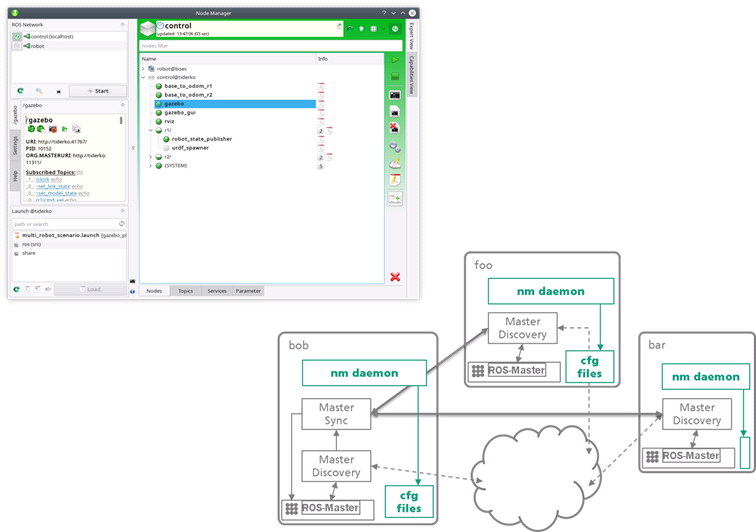

# FKIE multimaster for ROS

The ROS stack of *fkie_multimaster* offers a complete solution for using ROS with multicores.
In addition, Node Manager with a daemon provide a GUI-based management environment that is very useful to manage ROS-launch configurations and control running nodes, also in a single-core system.




## Install


For Ubuntu 18.04 LTS:
```
sudo add-apt-repository ppa:roehling/grpc
sudo apt-get update
sudo apt install python-grpcio python-grpc-tools
```

or 

For Ubuntu 20.04:

```
sudo apt install python3-grpcio python3-grpc-tools
```

You can run the following commands to setup a build from source:

```
cd catkin_ws/src
git clone https://github.com/JOiiNT-LAB/multimaster_fkie.git
rosdep update
rosdep install -i --as-root pip:false --reinstall --from-paths multimaster_fkie
```

Then build all packages:
```
cd catkin_ws
catkin_make
```
## Enable multicast
To permanently enable the multicast feature, edit the /etc/sysctl.conf file and add the following line, or uncomment it, if it already exists, and change its default value.
```
net.ipv4.icmp_echo_ignore_broadcasts=0
```
In order for the changes to take effect, execute the following command:
```
sudo service procps restart
```
To check which multicast groups are already defined in a computer, execute the following
command.
```
netstat -g
```
This command will report all the IP addresses enabled for multicast for each of the network
interfaces available, both for IPv4 and IPv6. The standard IP address for multicast is 224.0.0.1,
that should appear on the list provided by the last command, and it is the one we will use.
At this point, to check whether the multicast feature is working or not, execute the following
command, at any computer.

```
ping 224.0.0.1
```

## /etc/hosts
set your ip in the subnet and all other masters ip address.

JOiiNT LAB configuration:

1. 192.168.0.50	jntlbmc # PILOT STATION
2. 192.168.0.200	SXLS0-200916AA #MOBILE ROBOT
3. 192.168.0.20	joiintlab-XPS-13-9360 #PC ON THE MOBILE ROBOT
4. 192.168.0.40	nuk1-NUC10i7FNK #FRANKA PC

## .bashrc
Every master computer have to set ROS_MASTER_URI as the own machine address.
For example, in the "computer1" machine we have "192.168.0.5" as ip address in the subnet:
in the .bashrc file i'll write
```
export ROS_MASTER_URI=http://computer1:11311
```
if /etc/hosts is well written, or
```
export ROS_MASTER_URI=http://192.168.0.5:11311
```

## USAGE
At first configure the file launcher _multimaster.launch_ specifying the multicast address (usually 224.0.0.1), the user password and the network interface:
```
  <arg name="mcast_address" default="224.0.0.1" />
  <arg name="user_password" default="<machine-user>" /> 
  <arg name="user_interface" default="<interface-name>" /> #example: wlp62s0 or enp3s0
```
finally launch the file:
```
roslaunch fkie_master_discovery multimaster.launch
```
As alternative method you can run the node manually:

```
rosrun fkie_master_discovery master_discovery _mcast_group:=224.0.0.1
rosrun fkie_master_sync master_sync
```

To list masters in network
```
rosservice call /master_discovery/list_masters
```

## Troubleshooting

If running master_discovery gives you an error regarding to configure your network interface, it regards the multicast address, so follow what it say, for example:

```
sudo route add -net 224.0.0.0 netmast 224.0.0.0 <your-network-interface-name>
```


## This is a new version with daemon instance!

Whats new:

 * Remote access and control of launch and configuration files.
 * Easy remote editing of launch files.
 * Monitoring for ROS nodes and system resources on remote hosts.

> Old version is available on branch: `old_master` and is no longer supported!

## Documentation

* [multimaster\_fkie](http://fkie.github.io/multimaster_fkie)
* [discovery](http://fkie.github.io/multimaster_fkie/master_discovery.html) -- `discovery using multicast or zeroconf`
* [synchronization](http://fkie.github.io/multimaster_fkie/master_sync.html) -- `master synchronization`
* [Node Manager GUI](http://fkie.github.io/multimaster_fkie/node_manager.html) -- `A GUI to manage the configuration on local and remote ROS masters`
* [Node Manager daemon](http://fkie.github.io/multimaster_fkie/node_manager_daemon.html) -- `Helper node allows an easy (auto)start of remote nodes and manage remote launch files`

For ROS interfaces and parameterization see the [ROS Wiki](http://www.ros.org/wiki/multimaster_fkie). For configuration details you can find example launch files in each package.

